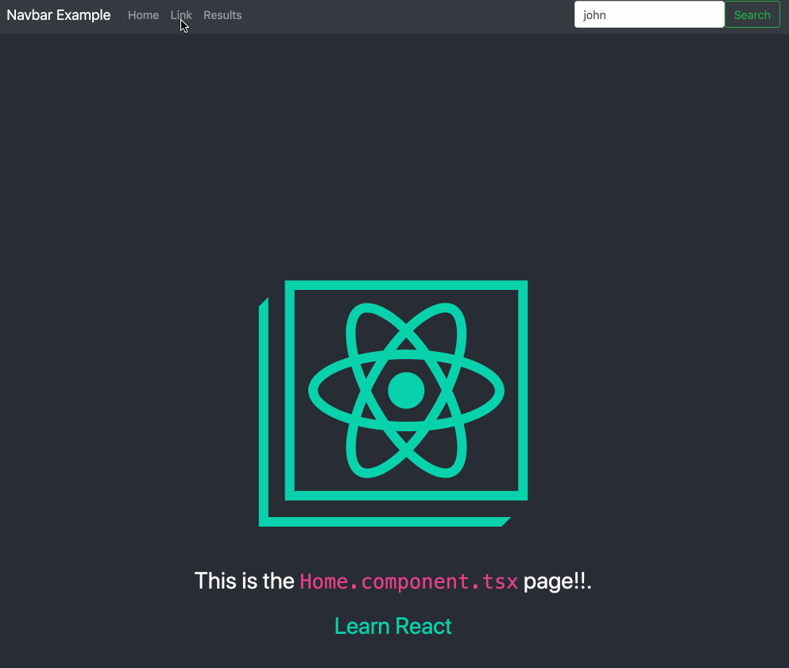

# React-Typescript-Router Template

Starting the App: 
    1) clone or download the repo
    2) `npm install` from the root directory
    3) `npm start` from root directory, to start the app

- - - -

This is a web app foundation template to bootstrap the initial creation of a react-typescript-router-dom project. The application showcases router functionality by utilizing a navigation bar across the top of the window. This is implemented with react-bootstrap!

